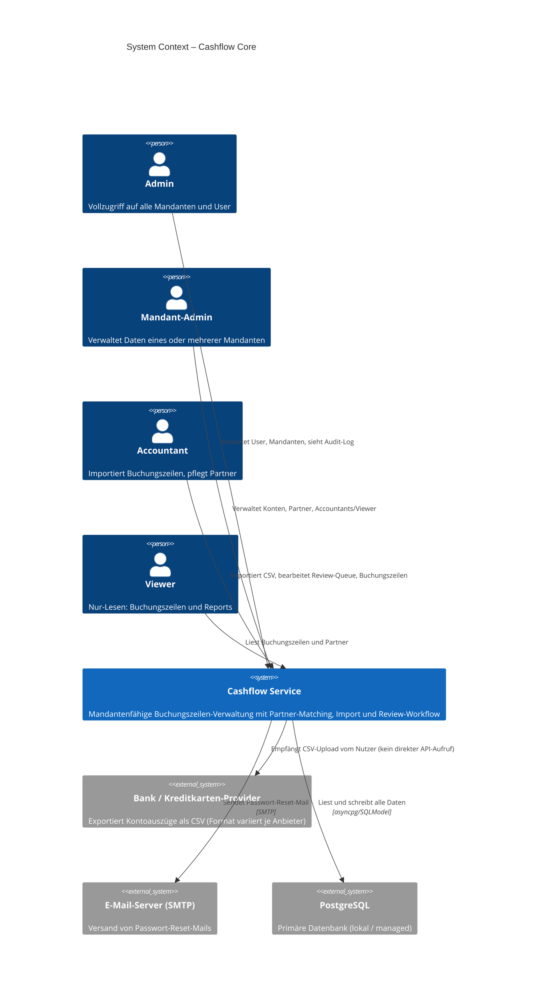

# Cashflow Core – System Context

## System Overview

Ein mandantenfähiges Web-Service zur Verwaltung von Bankbuchungen und Kreditkartentransaktionen. Buchungszeilen werden aus CSV-Exporten verschiedener Finanzinstitute importiert, automatisch Partnerunternehmen zugeordnet und in einer einheitlichen Datenstruktur gespeichert. Ein Review-Workflow sichert die Qualität automatischer Entscheidungen.

## Context Diagram

## Actors

| Actor | Typ | Beschreibung |
|-------|-----|-------------|
| Admin | Human User | Systemweiter Vollzugriff |
| Mandant-Admin | Human User | Vollzugriff auf zugewiesene Mandanten |
| Accountant | Human User | Import und Datenpflege |
| Viewer | Human User | Nur-Lesen |

## External Integrations

| System | Richtung | Daten | Protokoll |
|--------|----------|-------|-----------|
| Bank/Kreditkarten-CSV | Inbound (via User-Upload) | CSV-Kontoauszüge, variables Format | HTTP Multipart Upload |
| E-Mail-Server (SMTP) | Outbound | Passwort-Reset-Link | SMTP |
| PostgreSQL | Both | Alle persistenten Daten | asyncpg (TCP) |

## High-Level Constraints

- CSV-Format ist nicht standardisiert; Spalten-Mapping muss flexibel konfigurierbar sein
- Mandantenisolation muss serverseitig bei jedem Request erzwungen werden
- `unmapped_data` JSONB-Spalte sichert Rückwärtskompatibilität bei Mapping-Änderungen
- Kein externer Auth-Provider; JWT selbst implementiert

## Key NFR Goals

- **Sicherheit**: Null Cross-Tenant-Datenlecks; Audit-Log unveränderlich
- **Performance**: Import ≥ 500 Zeilen/s; API p95 < 300 ms
- **Zuverlässigkeit**: Import-Transaktion atomar (alles oder rollback)
- **Nachvollziehbarkeit**: Alle schreibenden Aktionen im Audit-Log
